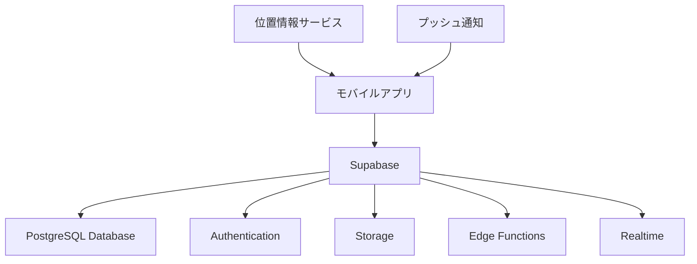

# 設計書

## 概要

「たべぶい」は、牛・豚・鳥の部位制覇を記録・管理するモバイルアプリケーションです。ユーザーが食べた肉の部位を記録し、ゲーミフィケーション要素を通じて楽しく制覇を目指せるプラットフォームを提供します。

## アーキテクチャ

### システム構成



### 技術スタック

- **フロントエンド**: React Native (iOS/Android対応)
- **バックエンド**: Supabase (BaaS)
  - データベース: PostgreSQL
  - 認証: Supabase Auth
  - ストレージ: Supabase Storage
  - リアルタイム: Supabase Realtime
  - サーバーサイド処理: Edge Functions (Deno)
- **画像ストレージ**: Supabase Storage
- **位置情報**: React Native Geolocation
- **プッシュ通知**: Expo Notifications

## コンポーネントと インターフェース

### 1. 認証システム

#### ユーザー管理
- Supabase Authによるユーザー登録・ログイン
- メール認証、ソーシャルログイン対応
- Row Level Security (RLS) によるデータアクセス制御

#### データモデル
```sql
-- Supabase auth.users テーブルを拡張
CREATE TABLE profiles (
  id UUID REFERENCES auth.users(id) PRIMARY KEY,
  username TEXT UNIQUE NOT NULL,
  bio TEXT,
  profile_image_url TEXT,
  level INTEGER DEFAULT 1,
  experience INTEGER DEFAULT 0,
  created_at TIMESTAMP WITH TIME ZONE DEFAULT NOW(),
  updated_at TIMESTAMP WITH TIME ZONE DEFAULT NOW()
);

-- RLS ポリシー
ALTER TABLE profiles ENABLE ROW LEVEL SECURITY;
CREATE POLICY "Users can view own profile" ON profiles FOR SELECT USING (auth.uid() = id);
CREATE POLICY "Users can update own profile" ON profiles FOR UPDATE USING (auth.uid() = id);
```

### 2. 部位管理システム

#### 部位データ管理
- 牛・豚・鳥の部位マスターデータ
- 部位詳細情報（説明、調理法、栄養情報）
- 部位の希少度・難易度設定

#### データモデル
```sql
-- 部位マスターテーブル
CREATE TABLE animal_parts (
  id UUID DEFAULT gen_random_uuid() PRIMARY KEY,
  animal_type TEXT NOT NULL CHECK (animal_type IN ('beef', 'pork', 'chicken')),
  name TEXT NOT NULL,
  name_kana TEXT NOT NULL,
  description TEXT,
  cooking_methods TEXT[],
  rarity TEXT DEFAULT 'common' CHECK (rarity IN ('common', 'uncommon', 'rare', 'legendary')),
  image_url TEXT,
  nutrition_info JSONB,
  created_at TIMESTAMP WITH TIME ZONE DEFAULT NOW()
);

-- 部位マスターデータは全ユーザー共通で読み取り専用
ALTER TABLE animal_parts ENABLE ROW LEVEL SECURITY;
CREATE POLICY "Animal parts are viewable by everyone" ON animal_parts FOR SELECT USING (true);
```

### 3. 記録管理システム

#### 食事記録機能
- 部位記録の作成・編集・削除
- 写真アップロード
- 位置情報記録
- 週目管理

#### データモデル
```sql
-- 食事記録テーブル
CREATE TABLE eating_records (
  id UUID DEFAULT gen_random_uuid() PRIMARY KEY,
  user_id UUID REFERENCES auth.users(id) NOT NULL,
  animal_part_id UUID REFERENCES animal_parts(id) NOT NULL,
  restaurant_id UUID REFERENCES restaurants(id),
  round_number INTEGER DEFAULT 1,
  photo_url TEXT,
  memo TEXT,
  location POINT,
  address TEXT,
  eaten_at TIMESTAMP WITH TIME ZONE DEFAULT NOW(),
  created_at TIMESTAMP WITH TIME ZONE DEFAULT NOW(),
  updated_at TIMESTAMP WITH TIME ZONE DEFAULT NOW()
);

-- RLS ポリシー
ALTER TABLE eating_records ENABLE ROW LEVEL SECURITY;
CREATE POLICY "Users can manage own eating records" ON eating_records 
  USING (auth.uid() = user_id);
```

### 4. お店管理システム

#### お店情報管理
- お店の登録・編集
- メニュー管理
- 位置情報連携

#### データモデル
```sql
-- レストランテーブル
CREATE TABLE restaurants (
  id UUID DEFAULT gen_random_uuid() PRIMARY KEY,
  name TEXT NOT NULL,
  address TEXT,
  phone_number TEXT,
  location POINT,
  created_by UUID REFERENCES auth.users(id),
  created_at TIMESTAMP WITH TIME ZONE DEFAULT NOW(),
  updated_at TIMESTAMP WITH TIME ZONE DEFAULT NOW()
);

-- メニューアイテムテーブル
CREATE TABLE menu_items (
  id UUID DEFAULT gen_random_uuid() PRIMARY KEY,
  restaurant_id UUID REFERENCES restaurants(id) NOT NULL,
  animal_part_id UUID REFERENCES animal_parts(id) NOT NULL,
  price INTEGER,
  description TEXT,
  is_available BOOLEAN DEFAULT true,
  created_at TIMESTAMP WITH TIME ZONE DEFAULT NOW()
);

-- RLS ポリシー
ALTER TABLE restaurants ENABLE ROW LEVEL SECURITY;
CREATE POLICY "Restaurants are viewable by everyone" ON restaurants FOR SELECT USING (true);
CREATE POLICY "Users can create restaurants" ON restaurants FOR INSERT WITH CHECK (auth.uid() = created_by);

ALTER TABLE menu_items ENABLE ROW LEVEL SECURITY;
CREATE POLICY "Menu items are viewable by everyone" ON menu_items FOR SELECT USING (true);
```

### 5. ウィッシュリスト管理

#### 食べたいリスト機能
- 部位とお店の組み合わせ管理
- 実食時の自動移行

#### データモデル
```sql
-- ウィッシュリストテーブル
CREATE TABLE wishlist_items (
  id UUID DEFAULT gen_random_uuid() PRIMARY KEY,
  user_id UUID REFERENCES auth.users(id) NOT NULL,
  animal_part_id UUID REFERENCES animal_parts(id) NOT NULL,
  restaurant_id UUID REFERENCES restaurants(id),
  priority TEXT DEFAULT 'medium' CHECK (priority IN ('low', 'medium', 'high')),
  notes TEXT,
  created_at TIMESTAMP WITH TIME ZONE DEFAULT NOW()
);

-- RLS ポリシー
ALTER TABLE wishlist_items ENABLE ROW LEVEL SECURITY;
CREATE POLICY "Users can manage own wishlist" ON wishlist_items 
  USING (auth.uid() = user_id);
```

### 6. ゲーミフィケーションシステム

#### レベル・経験値システム
- 部位記録による経験値獲得
- レベルアップ通知
- ボーナス経験値計算

#### バッジシステム
- 達成条件の管理
- バッジ授与ロジック
- バッジコレクション表示

#### データモデル
```sql
-- ユーザー進捗テーブル（各動物・週目ごと）
CREATE TABLE user_progress (
  id UUID DEFAULT gen_random_uuid() PRIMARY KEY,
  user_id UUID REFERENCES auth.users(id) NOT NULL,
  animal_type TEXT NOT NULL CHECK (animal_type IN ('beef', 'pork', 'chicken')),
  round_number INTEGER DEFAULT 1,
  completed_parts UUID[] DEFAULT '{}',
  completion_rate DECIMAL(5,2) DEFAULT 0,
  completed_at TIMESTAMP WITH TIME ZONE,
  created_at TIMESTAMP WITH TIME ZONE DEFAULT NOW(),
  updated_at TIMESTAMP WITH TIME ZONE DEFAULT NOW(),
  UNIQUE(user_id, animal_type, round_number)
);

-- バッジマスターテーブル
CREATE TABLE badges (
  id UUID DEFAULT gen_random_uuid() PRIMARY KEY,
  name TEXT NOT NULL,
  description TEXT,
  icon_url TEXT,
  category TEXT CHECK (category IN ('completion', 'streak', 'challenge', 'special')),
  condition JSONB NOT NULL,
  created_at TIMESTAMP WITH TIME ZONE DEFAULT NOW()
);

-- ユーザーバッジテーブル
CREATE TABLE user_badges (
  user_id UUID REFERENCES auth.users(id) NOT NULL,
  badge_id UUID REFERENCES badges(id) NOT NULL,
  earned_at TIMESTAMP WITH TIME ZONE DEFAULT NOW(),
  PRIMARY KEY (user_id, badge_id)
);

-- RLS ポリシー
ALTER TABLE user_progress ENABLE ROW LEVEL SECURITY;
CREATE POLICY "Users can manage own progress" ON user_progress 
  USING (auth.uid() = user_id);

ALTER TABLE badges ENABLE ROW LEVEL SECURITY;
CREATE POLICY "Badges are viewable by everyone" ON badges FOR SELECT USING (true);

ALTER TABLE user_badges ENABLE ROW LEVEL SECURITY;
CREATE POLICY "Users can view own badges" ON user_badges 
  USING (auth.uid() = user_id);
```

### 7. チャレンジシステム

#### チャレンジ管理
- 週間・月間チャレンジ
- 季節限定チャレンジ
- 進捗追跡

#### データモデル
```sql
-- チャレンジマスターテーブル
CREATE TABLE challenges (
  id UUID DEFAULT gen_random_uuid() PRIMARY KEY,
  title TEXT NOT NULL,
  description TEXT,
  type TEXT CHECK (type IN ('weekly', 'monthly', 'seasonal', 'special')),
  condition JSONB NOT NULL,
  reward JSONB,
  start_date TIMESTAMP WITH TIME ZONE NOT NULL,
  end_date TIMESTAMP WITH TIME ZONE NOT NULL,
  is_active BOOLEAN DEFAULT true,
  created_at TIMESTAMP WITH TIME ZONE DEFAULT NOW()
);

-- ユーザーチャレンジ進捗テーブル
CREATE TABLE user_challenges (
  user_id UUID REFERENCES auth.users(id) NOT NULL,
  challenge_id UUID REFERENCES challenges(id) NOT NULL,
  progress INTEGER DEFAULT 0,
  is_completed BOOLEAN DEFAULT false,
  completed_at TIMESTAMP WITH TIME ZONE,
  created_at TIMESTAMP WITH TIME ZONE DEFAULT NOW(),
  PRIMARY KEY (user_id, challenge_id)
);

-- RLS ポリシー
ALTER TABLE challenges ENABLE ROW LEVEL SECURITY;
CREATE POLICY "Challenges are viewable by everyone" ON challenges FOR SELECT USING (true);

ALTER TABLE user_challenges ENABLE ROW LEVEL SECURITY;
CREATE POLICY "Users can manage own challenges" ON user_challenges 
  USING (auth.uid() = user_id);
```

### 8. ランキングシステム

#### ランキング管理
- リアルタイムランキング計算
- 複数カテゴリ対応
- キャッシュ最適化

#### データモデル
```sql
-- ランキングビュー（リアルタイム計算）
CREATE VIEW user_rankings AS
SELECT 
  p.id as user_id,
  p.username,
  p.level,
  p.experience as score,
  ROW_NUMBER() OVER (ORDER BY p.experience DESC) as rank,
  'overall' as category,
  to_char(NOW(), 'YYYY-MM') as period
FROM profiles p
WHERE p.experience > 0;

-- 月間ランキング用のマテリアライズドビュー
CREATE MATERIALIZED VIEW monthly_rankings AS
SELECT 
  p.id as user_id,
  p.username,
  COUNT(er.id) as monthly_parts_count,
  ROW_NUMBER() OVER (ORDER BY COUNT(er.id) DESC) as rank,
  'monthly' as category,
  to_char(er.eaten_at, 'YYYY-MM') as period
FROM profiles p
JOIN eating_records er ON p.id = er.user_id
WHERE er.eaten_at >= date_trunc('month', NOW())
GROUP BY p.id, p.username, to_char(er.eaten_at, 'YYYY-MM');

-- 月間ランキングの定期更新用関数
CREATE OR REPLACE FUNCTION refresh_monthly_rankings()
RETURNS void AS $$
BEGIN
  REFRESH MATERIALIZED VIEW monthly_rankings;
END;
$$ LANGUAGE plpgsql;
```

## データモデル

### Supabaseデータベース設計

#### メインテーブル
1. **profiles** - ユーザープロフィール（auth.usersを拡張）
2. **animal_parts** - 部位マスターデータ
3. **eating_records** - 食事記録
4. **restaurants** - お店情報
5. **menu_items** - メニュー項目
6. **wishlist_items** - 食べたいリスト
7. **user_progress** - ユーザー進捗
8. **badges** - バッジマスター
9. **user_badges** - ユーザーバッジ
10. **challenges** - チャレンジマスター
11. **user_challenges** - ユーザーチャレンジ進捗

#### インデックス設計
```sql
-- パフォーマンス最適化用インデックス
CREATE INDEX idx_eating_records_user_animal_round ON eating_records(user_id, animal_part_id, round_number);
CREATE INDEX idx_eating_records_eaten_at ON eating_records(eaten_at);
CREATE INDEX idx_restaurants_location ON restaurants USING GIST(location);
CREATE INDEX idx_user_progress_user_animal ON user_progress(user_id, animal_type);
CREATE INDEX idx_animal_parts_type ON animal_parts(animal_type);
```

#### Edge Functions
```typescript
// 進捗更新用Edge Function
export const updateUserProgress = async (userId: string, animalPartId: string, roundNumber: number) => {
  // 部位記録時の進捗率計算とレベルアップ処理
  // バッジ獲得条件チェック
  // チャレンジ進捗更新
};

// ランキング更新用Edge Function  
export const updateRankings = async () => {
  // 定期的なランキング更新処理
};
```

## エラーハンドリング

### エラー分類
1. **認証エラー** - 401 Unauthorized
2. **認可エラー** - 403 Forbidden
3. **データ不正エラー** - 400 Bad Request
4. **リソース未発見エラー** - 404 Not Found
5. **サーバーエラー** - 500 Internal Server Error

### エラー対応
- ユーザーフレンドリーなエラーメッセージ
- オフライン時の一時保存機能
- 自動リトライ機能
- エラーログ収集

## テスト戦略

### テスト種別
1. **単体テスト** - 各コンポーネントの機能テスト
2. **統合テスト** - API連携テスト
3. **E2Eテスト** - ユーザーシナリオテスト
4. **パフォーマンステスト** - 負荷テスト

### テストデータ
- 部位マスターデータのテストセット
- ユーザー進捗の各段階テストデータ
- ゲーミフィケーション要素のテストシナリオ

### テスト自動化
- CI/CDパイプラインでの自動テスト実行
- デバイス別テスト（iOS/Android）
- パフォーマンス監視